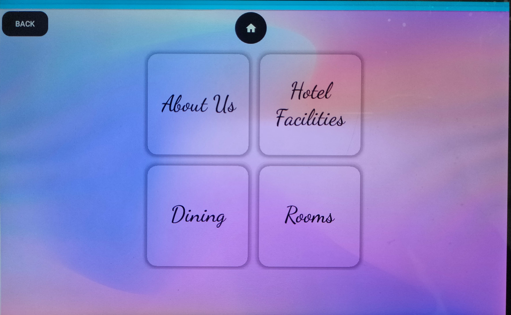
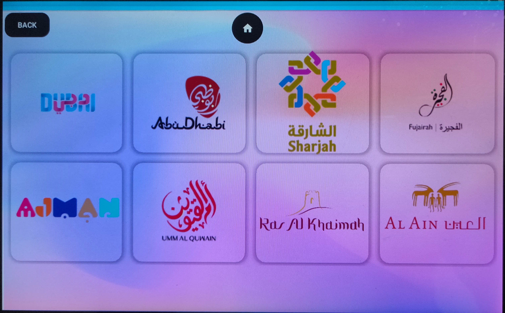
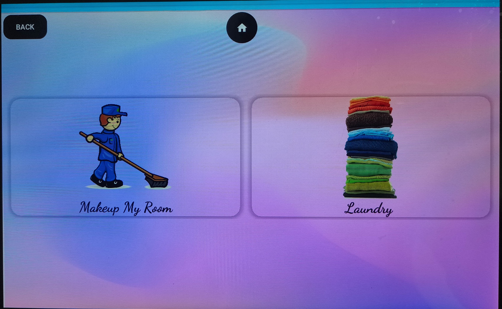
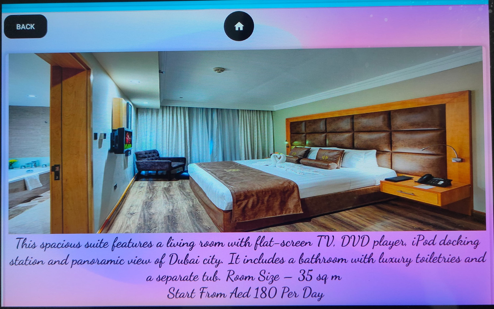

# Pepper Hotel Guide

## Overview

Pepper Hotel is an Android application developed for the Pepper Robot by SoftBank. The app serves as an informative guide for hotel visitors in Dubai, providing details about hotel services, local touristic places, and facilitating bookings for taxi and laundry services. The app utilizes the Strapi CMS APIs for content management and integrates seamlessly with the Pepper robot using the Pepper SDK.

## Features

- **Hotel Information:** Offers comprehensive details about the hotel and its services, enhancing the guest experience.
- **Touristic Places Guide:** Provides information about various touristic places in the UAE, aiding visitors in exploring the local attractions.
- **Booking Services:** Allows users to book taxi, housekeeping and laundry services directly through the app for added convenience.
- **Integration with Pepper SDK:** Fully utilizes the features of the Pepper robot using the Pepper SDK for a rich interactive humanoid experience.

## Technology Stack

- **Frontend:** Java for Android development
- **Backend:** Strapi CMS APIs
- **Integration:** Pepper SDK for Pepper robot features

## Project Responsibilities

- **Android App Development:** Designed and implemented the Android application using Java, ensuring a user-friendly interface and seamless functionality.
- **Strapi CMS Integration:** Integrated Strapi CMS APIs for efficient content management and data retrieval.
- **Pepper SDK Integration:** Utilized the Pepper SDK to fully leverage the capabilities of the Pepper robot, providing an interactive and engaging experience.

## Outcome

The Pepper Hotel Guide has successfully enhanced the guest experience by providing a user-friendly interface for accessing hotel information, exploring touristic places, and making convenient service bookings. The integration with Strapi CMS ensures up-to-date content, while the Pepper SDK enables a unique and interactive interaction with the Pepper robot.

## Screenshots

